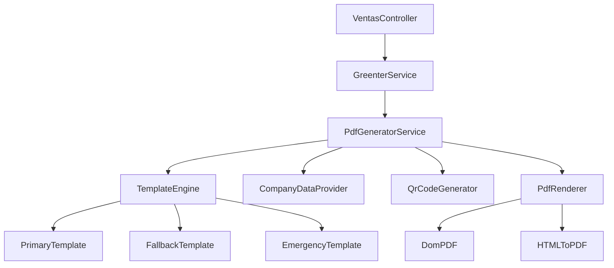

# Diseño - Sistema de PDF Compliant con SUNAT

## Overview

El diseño propuesto mejora el sistema actual de generación de PDF implementando un generador robusto que cumple con todos los requisitos legales de SUNAT. La solución utiliza un enfoque de plantillas HTML con múltiples niveles de fallback para garantizar la generación exitosa de PDFs profesionales y compliant.

## Architecture

### Componentes Principales



### Flujo de Generación

1. **Solicitud de PDF**: El controlador recibe la solicitud de generar PDF
2. **Validación**: Se valida que el comprobante tenga los datos necesarios
3. **Recolección de Datos**: Se obtienen todos los datos necesarios del comprobante, empresa y cliente
4. **Generación de Template**: Se procesa la plantilla HTML con los datos
5. **Renderizado**: Se convierte el HTML a PDF usando el motor disponible
6. **Almacenamiento**: Se guarda el PDF en base64 en la base de datos
7. **Respuesta**: Se retorna el resultado de la operación

## Components and Interfaces

### 1. PdfGeneratorService

**Responsabilidad**: Orquestar la generación completa del PDF

```php
interface PdfGeneratorInterface
{
    public function generatePdf(Comprobante $comprobante): PdfResult;
    public function validateComprobante(Comprobante $comprobante): ValidationResult;
    public function getAvailableTemplates(): array;
}
```

**Métodos principales**:
- `generatePdf()`: Método principal para generar PDF
- `validateComprobante()`: Validar datos del comprobante
- `collectCompanyData()`: Obtener datos de la empresa
- `generateQrCode()`: Generar código QR si es necesario

### 2. TemplateEngine

**Responsabilidad**: Procesar plantillas HTML con datos del comprobante

```php
interface TemplateEngineInterface
{
    public function render(string $template, array $data): string;
    public function getTemplate(string $type): string;
    public function validateTemplate(string $template): bool;
}
```

**Templates disponibles**:
- **PrimaryTemplate**: Plantilla principal con diseño completo
- **FallbackTemplate**: Plantilla simplificada pero compliant
- **EmergencyTemplate**: Plantilla mínima de emergencia

### 3. CompanyDataProvider

**Responsabilidad**: Proporcionar datos de la empresa emisora

```php
interface CompanyDataProviderInterface
{
    public function getCompanyInfo(): CompanyData;
    public function getLogoPath(): ?string;
    public function getContactInfo(): ContactData;
}
```

### 4. QrCodeGenerator

**Responsabilidad**: Generar códigos QR para verificación

```php
interface QrCodeGeneratorInterface
{
    public function generate(Comprobante $comprobante): string;
    public function getVerificationUrl(Comprobante $comprobante): string;
}
```

### 5. PdfRenderer

**Responsabilidad**: Convertir HTML a PDF usando diferentes motores

```php
interface PdfRendererInterface
{
    public function render(string $html): string;
    public function isAvailable(): bool;
    public function getEngineInfo(): array;
}
```

## Data Models

### PdfGenerationRequest

```php
class PdfGenerationRequest
{
    public Comprobante $comprobante;
    public string $templateType = 'primary';
    public array $options = [];
    public bool $forceRegenerate = false;
}
```

### PdfResult

```php
class PdfResult
{
    public bool $success;
    public ?string $pdfContent;
    public ?string $errorMessage;
    public string $templateUsed;
    public array $metadata;
    public float $generationTime;
}
```

### CompanyData

```php
class CompanyData
{
    public string $ruc;
    public string $razonSocial;
    public string $nombreComercial;
    public string $direccion;
    public string $distrito;
    public string $provincia;
    public string $departamento;
    public ?string $logoPath;
    public ?string $telefono;
    public ?string $email;
    public ?string $web;
}
```

### TemplateData

```php
class TemplateData
{
    public CompanyData $company;
    public Comprobante $comprobante;
    public Cliente $cliente;
    public array $detalles;
    public array $totales;
    public ?string $qrCode;
    public ?string $hashCode;
    public string $tipoComprobanteTexto;
    public string $totalEnLetras;
    public array $informacionLegal;
}
```

## Error Handling

### Estrategia de Fallback

1. **Nivel 1**: Plantilla principal con DomPDF
2. **Nivel 2**: Plantilla simplificada con DomPDF
3. **Nivel 3**: Plantilla de emergencia con generación HTML
4. **Nivel 4**: Texto plano como último recurso

### Manejo de Errores

```php
class PdfGenerationException extends Exception
{
    public string $errorCode;
    public array $context;
    public string $suggestedAction;
}
```

**Códigos de error**:
- `PDF_001`: Datos de comprobante incompletos
- `PDF_002`: Error en plantilla HTML
- `PDF_003`: Error en motor de renderizado
- `PDF_004`: Error de almacenamiento
- `PDF_005`: Error de validación

### Logging

Todos los intentos de generación se registran con:
- Timestamp
- Comprobante ID
- Template usado
- Motor de renderizado
- Tiempo de generación
- Resultado (éxito/error)
- Detalles del error si aplica

## Testing Strategy

### Unit Tests

1. **PdfGeneratorService Tests**
   - Generación exitosa con datos válidos
   - Manejo de datos incompletos
   - Fallback entre templates
   - Validación de comprobantes

2. **TemplateEngine Tests**
   - Renderizado de cada template
   - Manejo de datos faltantes
   - Validación de HTML generado

3. **CompanyDataProvider Tests**
   - Obtención de datos de empresa
   - Manejo de configuración faltante
   - Validación de rutas de logo

4. **QrCodeGenerator Tests**
   - Generación de códigos QR
   - URLs de verificación
   - Manejo de errores

### Integration Tests

1. **End-to-End PDF Generation**
   - Flujo completo desde controlador
   - Diferentes tipos de comprobante
   - Diferentes estados de comprobante

2. **Template Rendering**
   - Renderizado con datos reales
   - Validación de HTML generado
   - Compatibilidad con motores PDF

3. **Error Scenarios**
   - Datos corruptos
   - Templates faltantes
   - Motores PDF no disponibles

### Performance Tests

1. **Generation Speed**
   - Tiempo de generación por template
   - Comparación entre motores
   - Impacto de imágenes y QR codes

2. **Memory Usage**
   - Consumo de memoria por PDF
   - Limpieza de recursos
   - Manejo de múltiples generaciones

## Implementation Considerations

### Template Design

Las plantillas HTML seguirán estos principios:
- **Responsive**: Adaptable a diferentes tamaños
- **Print-friendly**: Optimizado para impresión
- **Accessible**: Cumple estándares de accesibilidad
- **Maintainable**: Código limpio y documentado

### Performance Optimization

- **Caching**: Cache de datos de empresa y templates
- **Lazy Loading**: Carga diferida de recursos pesados
- **Resource Management**: Limpieza automática de recursos temporales
- **Batch Processing**: Soporte para generación en lote

### Security Considerations

- **Input Validation**: Validación estricta de datos de entrada
- **Output Sanitization**: Limpieza de datos para HTML
- **File Security**: Manejo seguro de archivos temporales
- **Access Control**: Verificación de permisos de acceso

### Scalability

- **Horizontal Scaling**: Soporte para múltiples instancias
- **Queue Support**: Integración con colas para procesamiento asíncrono
- **Resource Limits**: Límites de memoria y tiempo de ejecución
- **Monitoring**: Métricas de rendimiento y salud del sistema

## Configuration

### Environment Variables

```env
# PDF Generation
PDF_DEFAULT_ENGINE=dompdf
PDF_TEMPLATE_PATH=resources/views/pdf
PDF_CACHE_ENABLED=true
PDF_CACHE_TTL=3600

# Company Data
COMPANY_LOGO_PATH=storage/app/public/logo.png
COMPANY_RUC=20123456789
COMPANY_NAME=Mi Empresa SAC

# QR Code
QR_ENABLED=true
QR_SIZE=150
QR_VERIFICATION_URL=https://e-consulta.sunat.gob.pe/cl-ti-itmrconsulta
```

### Template Configuration

```php
return [
    'templates' => [
        'primary' => 'pdf.comprobante-completo',
        'fallback' => 'pdf.comprobante-simple',
        'emergency' => 'pdf.comprobante-minimo'
    ],
    'engines' => [
        'dompdf' => DomPdfRenderer::class,
        'html2pdf' => Html2PdfRenderer::class,
        'emergency' => HtmlRenderer::class
    ],
    'options' => [
        'paper_size' => 'A4',
        'orientation' => 'portrait',
        'margin' => '10mm'
    ]
];
```