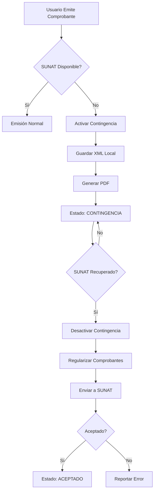

# API de Contingencia - Documentación Completa

## 📋 Índice
- [Descripción General](#descripción-general)
- [Endpoints Disponibles](#endpoints-disponibles)
- [Información de Contingencia](#información-de-contingencia)
- [Activar Modo Contingencia](#activar-modo-contingencia)
- [Desactivar Modo Contingencia](#desactivar-modo-contingencia)
- [Regularizar Comprobantes](#regularizar-comprobantes)
- [Estadísticas](#estadísticas)
- [Verificación Automática](#verificación-automática)
- [Ejemplos de Uso](#ejemplos-de-uso)

---

## Descripción General

El sistema de contingencia permite continuar emitiendo comprobantes electrónicos cuando los servicios de SUNAT no están disponibles. Los comprobantes se guardan localmente y se regularizan automáticamente cuando el servicio se restablece.

### Características

✅ Emisión offline cuando SUNAT no responde
✅ Generación de XML local
✅ Generación de PDF sin conexión
✅ Regularización automática
✅ Control de tiempo máximo (7 días)
✅ Registro de auditoría

---

## Endpoints Disponibles

### Base URL
```
/api/facturacion/contingencia/
```

### Autenticación
```http
Authorization: Bearer {token}
```

### Lista de Endpoints

| Método | Endpoint | Descripción |
|--------|----------|-------------|
| GET | `/info` | Información del estado |
| POST | `/activar` | Activar modo contingencia |
| POST | `/desactivar` | Desactivar modo |
| POST | `/regularizar` | Regularizar comprobantes |
| GET | `/estadisticas` | Estadísticas |
| POST | `/verificar` | Verificación automática |

---

## Información de Contingencia

### Endpoint
```http
GET /api/facturacion/contingencia/info
```

### Descripción
Obtiene información sobre el estado actual del modo contingencia.

### Response

**Modo Activo**
```json
{
  "success": true,
  "data": {
    "activo": true,
    "fecha_inicio": "2025-01-20 10:30:00",
    "motivo": "Servicio SUNAT no disponible",
    "duracion": "hace 2 horas",
    "comprobantes_pendientes": 15
  }
}
```

**Modo Inactivo**
```json
{
  "success": true,
  "data": {
    "activo": false
  }
}
```

---

## Activar Modo Contingencia

### Endpoint
```http
POST /api/facturacion/contingencia/activar
```

### Request Body
```json
{
  "motivo": "Servicio SUNAT no disponible"
}
```

### Validaciones
| Campo | Tipo | Requerido | Descripción |
|-------|------|-----------|-------------|
| motivo | string | Sí | Razón de activación (max 255) |

### Response

**Success (200)**
```json
{
  "success": true,
  "message": "Modo contingencia activado",
  "data": {
    "fecha_inicio": "2025-01-20 10:30:00",
    "motivo": "Servicio SUNAT no disponible"
  }
}
```

**Error - Ya Activo (400)**
```json
{
  "success": false,
  "message": "El modo contingencia ya está activo"
}
```

### Comportamiento

1. **Activación Manual**: El usuario puede activar manualmente cuando detecta que SUNAT no responde
2. **Cache**: Se guarda en cache por máximo 7 días
3. **Logging**: Se registra en logs la activación
4. **Notificación**: Se genera log de advertencia

---

## Desactivar Modo Contingencia

### Endpoint
```http
POST /api/facturacion/contingencia/desactivar
```

### Request
No requiere body.

### Response

**Success (200)**
```json
{
  "success": true,
  "message": "Modo contingencia desactivado",
  "data": {
    "fecha_inicio": "2025-01-20 10:30:00",
    "fecha_fin": "2025-01-20 14:45:00"
  }
}
```

**Error - No Activo (400)**
```json
{
  "success": false,
  "message": "El modo contingencia no está activo"
}
```

### Recomendación
Después de desactivar, ejecutar regularización para enviar comprobantes pendientes.

---

## Regularizar Comprobantes

### Endpoint
```http
POST /api/facturacion/contingencia/regularizar
```

### Descripción
Envía a SUNAT los comprobantes emitidos en modo contingencia.

### Query Parameters
| Parámetro | Tipo | Default | Descripción |
|-----------|------|---------|-------------|
| limite | integer | 50 | Máximo de comprobantes a procesar |

### Request
```http
POST /api/facturacion/contingencia/regularizar?limite=100
```

### Response

**Success (200)**
```json
{
  "success": true,
  "message": "Regularización completada: 45 exitosos, 5 fallidos",
  "data": {
    "total_procesados": 50,
    "regularizados": 45,
    "fallidos": 5,
    "errores": [
      {
        "comprobante_id": 123,
        "numero": "B001-00000010",
        "error": "Error 2801: Certificado digital vencido"
      },
      {
        "comprobante_id": 125,
        "numero": "B001-00000012",
        "error": "Error 2324: Ubigeo inválido"
      }
    ]
  }
}
```

**Error - SUNAT No Disponible (400)**
```json
{
  "success": false,
  "message": "SUNAT no está disponible, no se puede regularizar"
}
```

**Sin Comprobantes (200)**
```json
{
  "success": true,
  "message": "No hay comprobantes pendientes de regularización",
  "regularizados": 0,
  "fallidos": 0
}
```

### Proceso de Regularización

1. **Verificación**: Comprueba que SUNAT esté disponible
2. **Consulta**: Obtiene comprobantes con estado `CONTINGENCIA`
3. **Orden**: Procesa por fecha de emisión (primero los más antiguos)
4. **Envío**: Envía cada comprobante a SUNAT
5. **Pausa**: Espera 1 segundo entre cada envío
6. **Actualización**: Actualiza estados según respuesta
7. **Log**: Registra resultados

---

## Estadísticas

### Endpoint
```http
GET /api/facturacion/contingencia/estadisticas
```

### Response
```json
{
  "success": true,
  "data": {
    "modo_activo": true,
    "pendientes_regularizacion": 15,
    "total_regularizados": 150,
    "ultimos_comprobantes": [
      {
        "id": 123,
        "numero": "B001-00000010",
        "fecha_contingencia": "2025-01-20 10:35:00",
        "cliente": "EMPRESA EJEMPLO SAC",
        "importe": 1180.00
      },
      {
        "id": 124,
        "numero": "B001-00000011",
        "fecha_contingencia": "2025-01-20 10:40:00",
        "cliente": "CLIENTE NATURAL",
        "importe": 590.00
      }
    ]
  }
}
```

---

## Verificación Automática

### Endpoint
```http
POST /api/facturacion/contingencia/verificar
```

### Descripción
Verifica automáticamente el estado de SUNAT y activa/desactiva contingencia según corresponda.

### Comportamiento

1. **Verifica disponibilidad** de SUNAT (con cache de 2 minutos)
2. **Si SUNAT no disponible Y modo inactivo** → Activa automáticamente
3. **Si SUNAT disponible Y modo activo** → Desactiva y regulariza 10 comprobantes

### Response

**Activación Automática**
```json
{
  "success": true,
  "message": "Modo contingencia activado",
  "data": {
    "fecha_inicio": "2025-01-20 15:00:00",
    "motivo": "Activación automática - SUNAT no responde"
  }
}
```

**Desactivación y Regularización**
```json
{
  "success": true,
  "message": "Regularización completada: 8 exitosos, 2 fallidos",
  "data": {
    "total_procesados": 10,
    "regularizados": 8,
    "fallidos": 2,
    "errores": [...]
  }
}
```

**Sin Cambios**
```json
{
  "success": true,
  "message": "Estado verificado, sin cambios",
  "sunat_disponible": true,
  "modo_contingencia": false
}
```

---

## Ejemplos de Uso

### Ejemplo 1: Activar Contingencia (JavaScript)

```javascript
const activarContingencia = async () => {
  try {
    const response = await axios.post(
      '/api/facturacion/contingencia/activar',
      {
        motivo: 'Servicio SUNAT caído detectado manualmente'
      },
      {
        headers: {
          'Authorization': `Bearer ${token}`
        }
      }
    );

    console.log('Contingencia activada:', response.data);
    alert('Modo contingencia ACTIVADO. Los comprobantes se guardarán localmente.');

  } catch (error) {
    console.error('Error:', error.response.data);
  }
};
```

### Ejemplo 2: Regularizar con Retry (PHP)

```php
function regularizarComprobantes($token, $maxIntentos = 3) {
    $client = new \GuzzleHttp\Client();
    $intentos = 0;

    while ($intentos < $maxIntentos) {
        try {
            $response = $client->post(
                'https://api.ejemplo.com/api/facturacion/contingencia/regularizar',
                [
                    'query' => ['limite' => 50],
                    'headers' => [
                        'Authorization' => 'Bearer ' . $token
                    ]
                ]
            );

            $data = json_decode($response->getBody(), true);

            if ($data['success']) {
                echo "Regularizados: " . $data['data']['regularizados'];
                echo "Fallidos: " . $data['data']['fallidos'];
                return $data;
            }

        } catch (\Exception $e) {
            $intentos++;
            sleep(5); // Esperar 5 segundos antes de reintentar
        }
    }

    throw new Exception('No se pudo regularizar después de ' . $maxIntentos . ' intentos');
}
```

### Ejemplo 3: Verificación Periódica (Cron Job)

```bash
#!/bin/bash

# Script para ejecutar cada 5 minutos vía cron
# */5 * * * * /path/to/verificar-contingencia.sh

TOKEN="your_api_token"
API_URL="https://api.ejemplo.com/api/facturacion/contingencia/verificar"

curl -X POST "$API_URL" \
  -H "Authorization: Bearer $TOKEN" \
  -H "Content-Type: application/json" \
  >> /var/log/contingencia.log 2>&1
```

### Ejemplo 4: Monitoreo con Dashboard

```javascript
// React/Vue Component
const DashboardContingencia = () => {
  const [info, setInfo] = useState(null);

  useEffect(() => {
    const fetchInfo = async () => {
      const response = await axios.get('/api/facturacion/contingencia/info');
      setInfo(response.data.data);
    };

    fetchInfo();
    const interval = setInterval(fetchInfo, 30000); // Actualizar cada 30 segundos

    return () => clearInterval(interval);
  }, []);

  return (
    <div className={info?.activo ? 'alert-warning' : 'alert-success'}>
      {info?.activo ? (
        <>
          <h3>⚠️ MODO CONTINGENCIA ACTIVO</h3>
          <p>Desde: {info.fecha_inicio}</p>
          <p>Duración: {info.duracion}</p>
          <p>Comprobantes pendientes: {info.comprobantes_pendientes}</p>
          <button onClick={() => desactivarContingencia()}>
            Desactivar y Regularizar
          </button>
        </>
      ) : (
        <h3>✅ Sistema Operando Normalmente</h3>
      )}
    </div>
  );
};
```

---

## Flujo de Trabajo



---

## Estados de Comprobantes

| Estado | Descripción | Acción Siguiente |
|--------|-------------|------------------|
| CONTINGENCIA | Emitido offline | Regularizar cuando SUNAT esté disponible |
| ACEPTADO | Regularizado exitosamente | Ninguna |
| RECHAZADO | Error al regularizar | Revisar error y corregir |

---

## Códigos de Error

| Código HTTP | Descripción | Solución |
|-------------|-------------|----------|
| 400 | Modo ya activo/inactivo | Verificar estado actual |
| 500 | Error de servidor | Revisar logs |
| 422 | Validación fallida | Verificar campo motivo |

---

## Mejores Prácticas

### Activación
✅ Activar solo cuando SUNAT realmente no responda
✅ Proporcionar motivo descriptivo
✅ Notificar al usuario que está en modo offline
✅ Registrar la activación en logs

### Durante Contingencia
✅ Informar visualmente al usuario (banner, alerta)
✅ Generar XML y PDF localmente
✅ Guardar comprobantes con estado CONTINGENCIA
✅ No exceder 7 días en contingencia

### Regularización
✅ Verificar primero que SUNAT esté disponible
✅ Procesar en lotes pequeños (50-100)
✅ Esperar 1 segundo entre cada envío
✅ Registrar errores para análisis
✅ Reintentar comprobantes fallidos
✅ Notificar al usuario los resultados

### Monitoreo
✅ Implementar verificación automática cada 5 minutos
✅ Alertas cuando contingencia lleva más de 24 horas
✅ Dashboard con estado en tiempo real
✅ Logs detallados de todos los procesos

---

## Limitaciones

- **Tiempo máximo**: 7 días en cache
- **Regularización**: Máximo 1000 comprobantes por llamada
- **Verificación SUNAT**: Cache de 2 minutos
- **Pausa entre envíos**: 1 segundo (no modificable)

---

## Notas de Seguridad

🔒 Solo usuarios autenticados pueden acceder
🔒 Se registran todos los cambios de estado
🔒 Los XML se guardan cifrados
🔒 Auditoría completa de regularizaciones

---

**Última actualización:** 2025-01-20
**Versión:** 1.0.0
