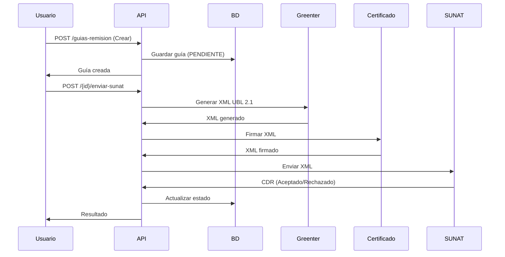

# API de Guías de Remisión - Documentación Completa

## 📋 Índice
- [Descripción General](#descripción-general)
- [Endpoints Disponibles](#endpoints-disponibles)
- [Crear Guía de Remisión](#crear-guía-de-remisión)
- [Listar Guías](#listar-guías)
- [Ver Detalle](#ver-detalle)
- [Enviar a SUNAT](#enviar-a-sunat)
- [Descargar XML](#descargar-xml)
- [Estadísticas](#estadísticas)
- [Ejemplos de Uso](#ejemplos-de-uso)
- [Códigos de Error](#códigos-de-error)

---

## Descripción General

Las Guías de Remisión Electrónicas son documentos tipo 09 que permiten el traslado de bienes entre diferentes ubicaciones. Este módulo implementa la generación, envío y gestión completa de guías según estándares UBL 2.1 de SUNAT.

### Características

✅ Generación de XML UBL 2.1
✅ Firma digital con certificado
✅ Envío SOAP a SUNAT
✅ Procesamiento de CDR
✅ Múltiples modalidades de traslado
✅ Validación de ubigeos
✅ Control de estados

---

## Endpoints Disponibles

### Base URL
```
/api/guias-remision/
```

### Autenticación
```http
Authorization: Bearer {token}
```

### Lista de Endpoints

| Método | Endpoint | Descripción |
|--------|----------|-------------|
| GET | `/` | Listar guías |
| POST | `/` | Crear guía |
| GET | `/{id}` | Ver detalle |
| POST | `/{id}/enviar-sunat` | Enviar a SUNAT |
| GET | `/{id}/xml` | Descargar XML |
| GET | `/estadisticas/resumen` | Estadísticas |

---

## Crear Guía de Remisión

### Endpoint
```http
POST /api/guias-remision
```

### Request Body

```json
{
  "cliente_id": 1,
  "destinatario_tipo_documento": "6",
  "destinatario_numero_documento": "20123456789",
  "destinatario_razon_social": "EMPRESA DESTINO SAC",
  "destinatario_direccion": "Av. Principal 123",
  "destinatario_ubigeo": "150101",

  "motivo_traslado": "01",
  "modalidad_traslado": "02",
  "fecha_inicio_traslado": "2025-01-20",

  "punto_partida_ubigeo": "150101",
  "punto_partida_direccion": "Jr. Los Olivos 456",

  "punto_llegada_ubigeo": "150102",
  "punto_llegada_direccion": "Av. Grau 789",

  "modo_transporte": "01",
  "numero_placa": "ABC-123",
  "numero_licencia": "Q12345678",
  "conductor_dni": "12345678",
  "conductor_nombres": "JUAN PEREZ GARCIA",

  "peso_total": 150.50,
  "numero_bultos": 5,

  "productos": [
    {
      "producto_id": 10,
      "cantidad": 10,
      "peso_unitario": 12.5,
      "observaciones": "Manejo con cuidado"
    },
    {
      "producto_id": 15,
      "cantidad": 5,
      "peso_unitario": 5.1
    }
  ],

  "observaciones": "Entregar en horario de oficina"
}
```

### Campos Requeridos

#### Destinatario
| Campo | Tipo | Descripción |
|-------|------|-------------|
| cliente_id | integer | ID del cliente remitente |
| destinatario_tipo_documento | string(1) | 1=DNI, 6=RUC |
| destinatario_numero_documento | string(20) | Número de documento |
| destinatario_razon_social | string(200) | Razón social o nombres |
| destinatario_direccion | string(200) | Dirección completa |
| destinatario_ubigeo | string(6) | Código ubigeo |

#### Traslado
| Campo | Tipo | Descripción |
|-------|------|-------------|
| motivo_traslado | string(2) | Ver catálogo de motivos |
| modalidad_traslado | string(2) | 01=Público, 02=Privado |
| fecha_inicio_traslado | date | Fecha de inicio |

#### Puntos de Traslado
| Campo | Tipo | Descripción |
|-------|------|-------------|
| punto_partida_ubigeo | string(6) | Ubigeo origen |
| punto_partida_direccion | string(200) | Dirección origen |
| punto_llegada_ubigeo | string(6) | Ubigeo destino |
| punto_llegada_direccion | string(200) | Dirección destino |

#### Transporte (Modalidad Privada)
| Campo | Tipo | Descripción |
|-------|------|-------------|
| numero_placa | string(20) | Placa del vehículo |
| numero_licencia | string(20) | Licencia del conductor |
| conductor_dni | string(8) | DNI del conductor |
| conductor_nombres | string(200) | Nombres del conductor |

#### Productos
| Campo | Tipo | Descripción |
|-------|------|-------------|
| producto_id | integer | ID del producto |
| cantidad | numeric | Cantidad a trasladar |
| peso_unitario | numeric | Peso por unidad (kg) |
| observaciones | string(500) | Notas opcionales |

### Catálogos

#### Motivos de Traslado (Catálogo 20)
| Código | Descripción |
|--------|-------------|
| 01 | Venta |
| 02 | Compra |
| 04 | Traslado entre establecimientos de la misma empresa |
| 08 | Importación |
| 09 | Exportación |
| 13 | Otros |

#### Modalidades de Traslado (Catálogo 18)
| Código | Descripción |
|--------|-------------|
| 01 | Transporte público |
| 02 | Transporte privado |

#### Modos de Transporte (Catálogo 05)
| Código | Descripción |
|--------|-------------|
| 01 | Transporte público |
| 02 | Transporte privado |

### Response

**Success (201)**
```json
{
  "success": true,
  "message": "Guía de remisión creada exitosamente",
  "data": {
    "id": 1,
    "tipo_comprobante": "09",
    "serie": "T001",
    "correlativo": 1,
    "numero_completo": "T001-00000001",
    "fecha_emision": "2025-01-20",
    "fecha_inicio_traslado": "2025-01-20",
    "cliente_id": 1,
    "cliente": {
      "id": 1,
      "razon_social": "EMPRESA REMITENTE SAC",
      "numero_documento": "20987654321"
    },
    "destinatario_razon_social": "EMPRESA DESTINO SAC",
    "destinatario_numero_documento": "20123456789",
    "motivo_traslado": "01",
    "modalidad_traslado": "02",
    "peso_total": 150.50,
    "numero_bultos": 5,
    "estado": "PENDIENTE",
    "detalles": [
      {
        "id": 1,
        "item": 1,
        "producto_id": 10,
        "codigo_producto": "PROD001",
        "descripcion": "LAPTOP HP PAVILION",
        "cantidad": 10,
        "peso_unitario": 12.5,
        "peso_total": 125.0,
        "producto": {
          "id": 10,
          "nombre": "LAPTOP HP PAVILION",
          "codigo_producto": "PROD001"
        }
      }
    ],
    "created_at": "2025-01-20T10:30:00.000000Z"
  }
}
```

**Error (422)**
```json
{
  "success": false,
  "message": "Datos de validación incorrectos",
  "errors": {
    "destinatario_ubigeo": ["El campo destinatario ubigeo es obligatorio."],
    "productos": ["El campo productos debe contener al menos 1 elementos."]
  }
}
```

---

## Listar Guías

### Endpoint
```http
GET /api/guias-remision
```

### Query Parameters

| Parámetro | Tipo | Descripción |
|-----------|------|-------------|
| estado | string | PENDIENTE, ENVIADO, ACEPTADO, RECHAZADO |
| fecha_inicio | date | Fecha desde (YYYY-MM-DD) |
| fecha_fin | date | Fecha hasta (YYYY-MM-DD) |
| cliente_id | integer | Filtrar por cliente |
| serie | string | Filtrar por serie |
| per_page | integer | Registros por página (default: 15) |

### Ejemplo Request
```http
GET /api/guias-remision?estado=ACEPTADO&fecha_inicio=2025-01-01&per_page=20
```

### Response
```json
{
  "success": true,
  "data": {
    "current_page": 1,
    "data": [
      {
        "id": 1,
        "numero_completo": "T001-00000001",
        "fecha_emision": "2025-01-20",
        "cliente_razon_social": "EMPRESA REMITENTE SAC",
        "destinatario_razon_social": "EMPRESA DESTINO SAC",
        "peso_total": 150.50,
        "estado": "ACEPTADO",
        "created_at": "2025-01-20T10:30:00.000000Z"
      }
    ],
    "per_page": 15,
    "total": 50
  }
}
```

---

## Ver Detalle

### Endpoint
```http
GET /api/guias-remision/{id}
```

### Response
```json
{
  "success": true,
  "data": {
    "id": 1,
    "tipo_comprobante": "09",
    "serie": "T001",
    "correlativo": 1,
    "numero_completo": "T001-00000001",
    "fecha_emision": "2025-01-20",
    "fecha_inicio_traslado": "2025-01-20",

    "cliente": {
      "id": 1,
      "razon_social": "EMPRESA REMITENTE SAC",
      "numero_documento": "20987654321"
    },

    "destinatario_tipo_documento": "6",
    "destinatario_numero_documento": "20123456789",
    "destinatario_razon_social": "EMPRESA DESTINO SAC",
    "destinatario_direccion": "Av. Principal 123",
    "destinatario_ubigeo": "150101",

    "motivo_traslado": "01",
    "modalidad_traslado": "02",
    "peso_total": 150.50,
    "numero_bultos": 5,

    "punto_partida_ubigeo": "150101",
    "punto_partida_direccion": "Jr. Los Olivos 456",
    "punto_llegada_ubigeo": "150102",
    "punto_llegada_direccion": "Av. Grau 789",

    "numero_placa": "ABC-123",
    "conductor_dni": "12345678",
    "conductor_nombres": "JUAN PEREZ GARCIA",

    "estado": "ACEPTADO",
    "xml_firmado": "[XML content]",
    "codigo_hash": "abc123...",
    "fecha_aceptacion": "2025-01-20T10:35:00.000000Z",

    "detalles": [
      {
        "id": 1,
        "item": 1,
        "producto": {
          "id": 10,
          "nombre": "LAPTOP HP PAVILION",
          "codigo_producto": "PROD001"
        },
        "descripcion": "LAPTOP HP PAVILION",
        "cantidad": 10,
        "peso_unitario": 12.5,
        "peso_total": 125.0
      }
    ],

    "usuario": {
      "id": 1,
      "name": "Admin Usuario"
    }
  }
}
```

---

## Enviar a SUNAT

### Endpoint
```http
POST /api/guias-remision/{id}/enviar-sunat
```

### Descripción
Genera el XML UBL 2.1, firma digitalmente y envía la guía a SUNAT.

### Request
```http
POST /api/guias-remision/1/enviar-sunat
```

### Response

**Success (200)**
```json
{
  "success": true,
  "message": "Guía de remisión enviada a SUNAT exitosamente",
  "data": {
    "id": 1,
    "numero_completo": "T001-00000001",
    "estado": "ACEPTADO",
    "xml_firmado": "[XML content]",
    "xml_respuesta_sunat": "[CDR content]",
    "mensaje_sunat": "La Guía de Remisión ha sido aceptada",
    "codigo_hash": "abc123...",
    "fecha_aceptacion": "2025-01-20T10:35:00.000000Z"
  }
}
```

**Error - Ya enviado (400)**
```json
{
  "success": false,
  "message": "La guía de remisión no puede ser enviada en su estado actual"
}
```

**Error - Rechazo SUNAT (500)**
```json
{
  "success": false,
  "message": "Error al enviar guía de remisión a SUNAT",
  "error": "Código 2324: El ubigeo del punto de llegada es inválido"
}
```

### Estados de la Guía

| Estado | Descripción |
|--------|-------------|
| PENDIENTE | Creada, no enviada |
| ENVIADO | Enviada a SUNAT, esperando respuesta |
| ACEPTADO | Aceptada por SUNAT |
| RECHAZADO | Rechazada por SUNAT |
| ANULADO | Anulada por el usuario |

---

## Descargar XML

### Endpoint
```http
GET /api/guias-remision/{id}/xml
```

### Response

**Success (200)**
```json
{
  "success": true,
  "data": {
    "xml": "<?xml version=\"1.0\" encoding=\"UTF-8\"?>...",
    "filename": "T001-00000001.xml"
  }
}
```

**Error (404)**
```json
{
  "success": false,
  "message": "No hay XML disponible para esta guía de remisión"
}
```

---

## Estadísticas

### Endpoint
```http
GET /api/guias-remision/estadisticas/resumen
```

### Query Parameters
| Parámetro | Tipo | Descripción |
|-----------|------|-------------|
| fecha_inicio | date | Fecha desde |
| fecha_fin | date | Fecha hasta |

### Response
```json
{
  "success": true,
  "data": {
    "total_guias": 150,
    "guias_pendientes": 5,
    "guias_enviadas": 10,
    "guias_aceptadas": 130,
    "guias_rechazadas": 5,
    "peso_total_transportado": 15500.75
  }
}
```

---

## Ejemplos de Uso

### Ejemplo 1: Crear Guía (JavaScript/Axios)

```javascript
const crearGuia = async () => {
  try {
    const response = await axios.post('/api/guias-remision', {
      cliente_id: 1,
      destinatario_tipo_documento: '6',
      destinatario_numero_documento: '20123456789',
      destinatario_razon_social: 'EMPRESA DESTINO SAC',
      destinatario_direccion: 'Av. Principal 123',
      destinatario_ubigeo: '150101',

      motivo_traslado: '01',
      modalidad_traslado: '02',
      fecha_inicio_traslado: '2025-01-20',

      punto_partida_ubigeo: '150101',
      punto_partida_direccion: 'Jr. Los Olivos 456',
      punto_llegada_ubigeo: '150102',
      punto_llegada_direccion: 'Av. Grau 789',

      numero_placa: 'ABC-123',
      conductor_dni: '12345678',
      conductor_nombres: 'JUAN PEREZ',

      productos: [
        {
          producto_id: 10,
          cantidad: 10,
          peso_unitario: 12.5
        }
      ]
    }, {
      headers: {
        'Authorization': `Bearer ${token}`
      }
    });

    console.log('Guía creada:', response.data);
  } catch (error) {
    console.error('Error:', error.response.data);
  }
};
```

### Ejemplo 2: Enviar a SUNAT (PHP/Guzzle)

```php
use GuzzleHttp\Client;

$client = new Client();

try {
    $response = $client->post('https://api.ejemplo.com/api/guias-remision/1/enviar-sunat', [
        'headers' => [
            'Authorization' => 'Bearer ' . $token,
            'Accept' => 'application/json'
        ]
    ]);

    $data = json_decode($response->getBody(), true);
    echo "Estado: " . $data['data']['estado'];

} catch (\Exception $e) {
    echo "Error: " . $e->getMessage();
}
```

### Ejemplo 3: Listar con Filtros (cURL)

```bash
curl -X GET \
  'https://api.ejemplo.com/api/guias-remision?estado=ACEPTADO&fecha_inicio=2025-01-01' \
  -H 'Authorization: Bearer {token}' \
  -H 'Accept: application/json'
```

---

## Códigos de Error

### Errores de Validación (422)

| Campo | Error | Solución |
|-------|-------|----------|
| destinatario_ubigeo | Requerido | Proporcionar ubigeo válido de 6 dígitos |
| productos | Mínimo 1 | Agregar al menos un producto |
| peso_unitario | Debe ser numérico | Usar formato decimal (12.5) |
| fecha_inicio_traslado | Formato inválido | Usar formato YYYY-MM-DD |

### Errores de SUNAT

| Código | Descripción | Solución |
|--------|-------------|----------|
| 2324 | Ubigeo inválido | Verificar código de ubigeo |
| 2801 | Serie inválida | Verificar configuración de series |
| 4033 | Certificado vencido | Renovar certificado digital |

---

## Flujo Completo



---

## Notas Importantes

### Requisitos Previos
1. ✅ Certificado digital configurado
2. ✅ Serie tipo 09 creada y activa
3. ✅ Credenciales SOL SUNAT configuradas
4. ✅ Productos registrados en el sistema

### Validaciones de Negocio
- El peso_total se calcula automáticamente sumando los pesos de productos
- No se puede enviar una guía que ya fue aceptada
- Solo se pueden enviar guías en estado PENDIENTE
- Los ubigeos deben ser válidos según catálogo SUNAT

### Recomendaciones
- Validar ubigeos antes de crear la guía
- Verificar datos del conductor (DNI, licencia)
- Revisar placa del vehículo
- Confirmar direcciones completas
- Validar stock de productos

---

**Última actualización:** 2025-01-20
**Versión:** 1.0.0
