# 🎨 Integración Frontend - Guías de Remisión

## 📋 Información General

Esta documentación proporciona una guía completa para integrar el módulo de guías de remisión en el frontend, incluyendo componentes UI/UX, flujos de trabajo y ejemplos de implementación.

## 🎯 Objetivos del Frontend

### **Funcionalidades Principales**
- ✅ **Crear guías de remisión** con interfaz intuitiva
- ✅ **Listar y filtrar** guías existentes
- ✅ **Ver detalles** completos de cada guía
- ✅ **Enviar a SUNAT** con confirmación visual
- ✅ **Descargar archivos** (XML, PDF, CDR)
- ✅ **Dashboard** con estadísticas en tiempo real
- ✅ **Notificaciones** de estado y errores

## 🏗️ Arquitectura de Componentes

### **Estructura de Componentes Recomendada**

```
src/
├── components/
│   ├── guias/
│   │   ├── GuiaForm.vue              # Formulario de creación
│   │   ├── GuiaList.vue              # Listado con filtros
│   │   ├── GuiaDetail.vue            # Vista de detalle
│   │   ├── GuiaCard.vue              # Tarjeta de resumen
│   │   ├── GuiaStatus.vue            # Indicador de estado
│   │   ├── GuiaActions.vue           # Botones de acción
│   │   └── GuiaStats.vue             # Estadísticas
│   ├── shared/
│   │   ├── FileDownloader.vue        # Descarga de archivos
│   │   ├── StatusBadge.vue           # Badge de estado
│   │   └── LoadingSpinner.vue        # Indicador de carga
│   └── layout/
│       ├── DashboardLayout.vue       # Layout principal
│       └── SidebarMenu.vue           # Menú lateral
├── views/
│   ├── GuiasView.vue                 # Vista principal
│   ├── GuiaCreateView.vue            # Vista de creación
│   ├── GuiaDetailView.vue            # Vista de detalle
│   └── GuiaStatsView.vue             # Vista de estadísticas
├── services/
│   ├── guiaService.js                # Servicio API
│   └── notificationService.js        # Servicio notificaciones
└── stores/
    └── guiaStore.js                  # Store Pinia/Vuex
```

## 🎨 Diseño UI/UX

### **Paleta de Colores**

```css
:root {
  /* Colores principales */
  --primary-color: #2563eb;      /* Azul principal */
  --primary-light: #3b82f6;      /* Azul claro */
  --primary-dark: #1d4ed8;       /* Azul oscuro */
  
  /* Colores de estado */
  --success-color: #10b981;      /* Verde - Aceptado */
  --warning-color: #f59e0b;      /* Amarillo - Pendiente */
  --error-color: #ef4444;        /* Rojo - Rechazado */
  --info-color: #06b6d4;         /* Cian - Enviado */
  
  /* Colores neutros */
  --gray-50: #f9fafb;
  --gray-100: #f3f4f6;
  --gray-200: #e5e7eb;
  --gray-300: #d1d5db;
  --gray-400: #9ca3af;
  --gray-500: #6b7280;
  --gray-600: #4b5563;
  --gray-700: #374151;
  --gray-800: #1f2937;
  --gray-900: #111827;
}
```

### **Estados Visuales**

```css
/* Estados de guías */
.status-pendiente {
  background-color: var(--warning-color);
  color: white;
}

.status-enviado {
  background-color: var(--info-color);
  color: white;
}

.status-aceptado {
  background-color: var(--success-color);
  color: white;
}

.status-rechazado {
  background-color: var(--error-color);
  color: white;
}

.status-anulado {
  background-color: var(--gray-500);
  color: white;
}
```

## 📱 Componentes Principales

### **1. Formulario de Creación (GuiaForm.vue)**

```vue
<template>
  <div class="guia-form">
    <div class="form-header">
      <h2>Nueva Guía de Remisión</h2>
      <p>Complete los datos para crear una nueva guía de remisión</p>
    </div>

    <form @submit.prevent="submitForm" class="space-y-6">
      <!-- Sección Cliente -->
      <div class="form-section">
        <h3>Datos del Cliente (Remitente)</h3>
        <div class="grid grid-cols-1 md:grid-cols-2 gap-4">
          <div>
            <label>Cliente *</label>
            <ClientSelector 
              v-model="form.cliente_id" 
              @change="onClienteChange"
              :error="errors.cliente_id"
            />
          </div>
        </div>
      </div>

      <!-- Sección Destinatario -->
      <div class="form-section">
        <h3>Datos del Destinatario</h3>
        <div class="grid grid-cols-1 md:grid-cols-2 gap-4">
          <div>
            <label>Tipo de Documento *</label>
            <select v-model="form.destinatario_tipo_documento" required>
              <option value="1">DNI</option>
              <option value="4">Carnet de Extranjería</option>
              <option value="6">RUC</option>
              <option value="7">Pasaporte</option>
            </select>
          </div>
          <div>
            <label>Número de Documento *</label>
            <input 
              v-model="form.destinatario_numero_documento"
              type="text"
              maxlength="20"
              required
            />
          </div>
          <div class="md:col-span-2">
            <label>Razón Social *</label>
            <input 
              v-model="form.destinatario_razon_social"
              type="text"
              maxlength="200"
              required
            />
          </div>
          <div class="md:col-span-2">
            <label>Dirección *</label>
            <input 
              v-model="form.destinatario_direccion"
              type="text"
              maxlength="200"
              required
            />
          </div>
          <div>
            <label>Ubigeo *</label>
            <UbigeoSelector 
              v-model="form.destinatario_ubigeo"
              required
            />
          </div>
        </div>
      </div>

      <!-- Sección Traslado -->
      <div class="form-section">
        <h3>Información del Traslado</h3>
        <div class="grid grid-cols-1 md:grid-cols-2 gap-4">
          <div>
            <label>Motivo de Traslado *</label>
            <select v-model="form.motivo_traslado" required>
              <option value="01">Venta</option>
              <option value="02">Compra</option>
              <option value="04">Traslado entre establecimientos</option>
              <option value="08">Importación</option>
              <option value="09">Exportación</option>
              <option value="13">Otros</option>
            </select>
          </div>
          <div>
            <label>Modalidad de Traslado *</label>
            <select v-model="form.modalidad_traslado" required>
              <option value="01">Venta</option>
              <option value="02">Compra</option>
              <option value="04">Traslado entre establecimientos</option>
              <option value="08">Importación</option>
              <option value="09">Exportación</option>
              <option value="13">Otros</option>
            </select>
          </div>
          <div>
            <label>Fecha de Inicio de Traslado *</label>
            <input 
              v-model="form.fecha_inicio_traslado"
              type="date"
              required
            />
          </div>
          <div>
            <label>Modo de Transporte</label>
            <select v-model="form.modo_transporte">
              <option value="01">Transporte público</option>
              <option value="02">Transporte privado</option>
            </select>
          </div>
        </div>
      </div>

      <!-- Sección Transporte -->
      <div class="form-section">
        <h3>Información del Transporte</h3>
        <div class="grid grid-cols-1 md:grid-cols-2 gap-4">
          <div>
            <label>Número de Placa</label>
            <input 
              v-model="form.numero_placa"
              type="text"
              maxlength="20"
            />
          </div>
          <div>
            <label>Número de Licencia</label>
            <input 
              v-model="form.numero_licencia"
              type="text"
              maxlength="20"
            />
          </div>
          <div>
            <label>DNI del Conductor</label>
            <input 
              v-model="form.conductor_dni"
              type="text"
              maxlength="8"
            />
          </div>
          <div>
            <label>Nombres del Conductor</label>
            <input 
              v-model="form.conductor_nombres"
              type="text"
              maxlength="200"
            />
          </div>
        </div>
      </div>

      <!-- Sección Puntos -->
      <div class="form-section">
        <h3>Puntos de Partida y Llegada</h3>
        <div class="grid grid-cols-1 md:grid-cols-2 gap-6">
          <div>
            <h4>Punto de Partida</h4>
            <div class="space-y-4">
              <div>
                <label>Ubigeo *</label>
                <UbigeoSelector 
                  v-model="form.punto_partida_ubigeo"
                  required
                />
              </div>
              <div>
                <label>Dirección *</label>
                <input 
                  v-model="form.punto_partida_direccion"
                  type="text"
                  maxlength="200"
                  required
                />
              </div>
            </div>
          </div>
          <div>
            <h4>Punto de Llegada</h4>
            <div class="space-y-4">
              <div>
                <label>Ubigeo *</label>
                <UbigeoSelector 
                  v-model="form.punto_llegada_ubigeo"
                  required
                />
              </div>
              <div>
                <label>Dirección *</label>
                <input 
                  v-model="form.punto_llegada_direccion"
                  type="text"
                  maxlength="200"
                  required
                />
              </div>
            </div>
          </div>
        </div>
      </div>

      <!-- Sección Productos -->
      <div class="form-section">
        <h3>Productos a Transportar</h3>
        <ProductSelector 
          v-model="form.productos"
          @change="calculateTotals"
        />
        <div class="totals-summary">
          <div class="total-item">
            <span>Peso Total:</span>
            <strong>{{ form.peso_total }} kg</strong>
          </div>
          <div class="total-item">
            <span>Número de Bultos:</span>
            <strong>{{ form.numero_bultos }}</strong>
          </div>
        </div>
      </div>

      <!-- Observaciones -->
      <div class="form-section">
        <label>Observaciones</label>
        <textarea 
          v-model="form.observaciones"
          rows="3"
          placeholder="Observaciones adicionales..."
        ></textarea>
      </div>

      <!-- Botones -->
      <div class="form-actions">
        <button type="button" @click="cancel" class="btn-secondary">
          Cancelar
        </button>
        <button type="submit" :disabled="loading" class="btn-primary">
          <LoadingSpinner v-if="loading" size="sm" />
          {{ loading ? 'Creando...' : 'Crear Guía' }}
        </button>
      </div>
    </form>
  </div>
</template>

<script setup>
import { ref, reactive, computed } from 'vue'
import { useRouter } from 'vue-router'
import { useGuiaStore } from '@/stores/guiaStore'
import { useNotificationStore } from '@/stores/notificationStore'

const router = useRouter()
const guiaStore = useGuiaStore()
const notificationStore = useNotificationStore()

const loading = ref(false)
const errors = ref({})

const form = reactive({
  cliente_id: null,
  destinatario_tipo_documento: '1',
  destinatario_numero_documento: '',
  destinatario_razon_social: '',
  destinatario_direccion: '',
  destinatario_ubigeo: '',
  motivo_traslado: '01',
  modalidad_traslado: '01',
  fecha_inicio_traslado: new Date().toISOString().split('T')[0],
  peso_total: 0,
  numero_bultos: 1,
  modo_transporte: '01',
  numero_placa: '',
  numero_licencia: '',
  conductor_dni: '',
  conductor_nombres: '',
  punto_partida_ubigeo: '',
  punto_partida_direccion: '',
  punto_llegada_ubigeo: '',
  punto_llegada_direccion: '',
  observaciones: '',
  productos: []
})

const calculateTotals = () => {
  form.peso_total = form.productos.reduce((total, producto) => {
    return total + (producto.cantidad * producto.peso_unitario)
  }, 0)
  form.numero_bultos = form.productos.length
}

const onClienteChange = (cliente) => {
  if (cliente) {
    form.punto_partida_direccion = cliente.direccion
    form.punto_partida_ubigeo = cliente.ubigeo || '150101'
  }
}

const submitForm = async () => {
  loading.value = true
  errors.value = {}

  try {
    const response = await guiaStore.createGuia(form)
    
    notificationStore.showSuccess('Guía de remisión creada exitosamente')
    router.push(`/guias/${response.data.id}`)
  } catch (error) {
    if (error.response?.status === 422) {
      errors.value = error.response.data.errors
    } else {
      notificationStore.showError('Error al crear la guía de remisión')
    }
  } finally {
    loading.value = false
  }
}

const cancel = () => {
  router.push('/guias')
}
</script>

<style scoped>
.guia-form {
  max-width: 1200px;
  margin: 0 auto;
  padding: 2rem;
}

.form-header {
  margin-bottom: 2rem;
  text-align: center;
}

.form-section {
  background: white;
  padding: 1.5rem;
  border-radius: 0.5rem;
  box-shadow: 0 1px 3px rgba(0, 0, 0, 0.1);
  margin-bottom: 1.5rem;
}

.form-section h3 {
  font-size: 1.25rem;
  font-weight: 600;
  margin-bottom: 1rem;
  color: var(--gray-800);
}

.totals-summary {
  display: flex;
  gap: 2rem;
  margin-top: 1rem;
  padding: 1rem;
  background: var(--gray-50);
  border-radius: 0.5rem;
}

.total-item {
  display: flex;
  flex-direction: column;
  align-items: center;
}

.total-item span {
  font-size: 0.875rem;
  color: var(--gray-600);
}

.total-item strong {
  font-size: 1.25rem;
  color: var(--primary-color);
}

.form-actions {
  display: flex;
  justify-content: flex-end;
  gap: 1rem;
  margin-top: 2rem;
}
</style>
```

### **2. Listado de Guías (GuiaList.vue)**

```vue
<template>
  <div class="guia-list">
    <!-- Header con filtros -->
    <div class="list-header">
      <div class="header-content">
        <h1>Guías de Remisión</h1>
        <button @click="createNew" class="btn-primary">
          <PlusIcon class="w-5 h-5" />
          Nueva Guía
        </button>
      </div>
      
      <!-- Filtros -->
      <div class="filters">
        <div class="filter-group">
          <label>Estado</label>
          <select v-model="filters.estado" @change="applyFilters">
            <option value="">Todos</option>
            <option value="PENDIENTE">Pendiente</option>
            <option value="ENVIADO">Enviado</option>
            <option value="ACEPTADO">Aceptado</option>
            <option value="RECHAZADO">Rechazado</option>
            <option value="ANULADO">Anulado</option>
          </select>
        </div>
        
        <div class="filter-group">
          <label>Fecha Inicio</label>
          <input 
            v-model="filters.fecha_inicio" 
            type="date"
            @change="applyFilters"
          />
        </div>
        
        <div class="filter-group">
          <label>Fecha Fin</label>
          <input 
            v-model="filters.fecha_fin" 
            type="date"
            @change="applyFilters"
          />
        </div>
        
        <div class="filter-group">
          <label>Cliente</label>
          <ClientSelector 
            v-model="filters.cliente_id"
            @change="applyFilters"
            placeholder="Seleccionar cliente"
          />
        </div>
        
        <button @click="clearFilters" class="btn-secondary">
          Limpiar Filtros
        </button>
      </div>
    </div>

    <!-- Estadísticas rápidas -->
    <div class="stats-grid">
      <div class="stat-card">
        <div class="stat-value">{{ stats.total_guias }}</div>
        <div class="stat-label">Total Guías</div>
      </div>
      <div class="stat-card">
        <div class="stat-value">{{ stats.guias_pendientes }}</div>
        <div class="stat-label">Pendientes</div>
      </div>
      <div class="stat-card">
        <div class="stat-value">{{ stats.guias_aceptadas }}</div>
        <div class="stat-label">Aceptadas</div>
      </div>
      <div class="stat-card">
        <div class="stat-value">{{ stats.peso_total_transportado }} kg</div>
        <div class="stat-label">Peso Total</div>
      </div>
    </div>

    <!-- Lista de guías -->
    <div class="guias-container">
      <div v-if="loading" class="loading-state">
        <LoadingSpinner size="lg" />
        <p>Cargando guías...</p>
      </div>

      <div v-else-if="guias.length === 0" class="empty-state">
        <PackageIcon class="w-16 h-16 text-gray-400" />
        <h3>No hay guías de remisión</h3>
        <p>Crea tu primera guía de remisión para comenzar</p>
        <button @click="createNew" class="btn-primary">
          Crear Primera Guía
        </button>
      </div>

      <div v-else class="guias-grid">
        <GuiaCard 
          v-for="guia in guias" 
          :key="guia.id"
          :guia="guia"
          @view="viewGuia"
          @send="sendToSunat"
          @download="downloadFile"
        />
      </div>
    </div>

    <!-- Paginación -->
    <Pagination 
      v-if="pagination.last_page > 1"
      :current-page="pagination.current_page"
      :last-page="pagination.last_page"
      :total="pagination.total"
      @page-change="onPageChange"
    />
  </div>
</template>

<script setup>
import { ref, reactive, onMounted, computed } from 'vue'
import { useRouter } from 'vue-router'
import { useGuiaStore } from '@/stores/guiaStore'
import { useNotificationStore } from '@/stores/notificationStore'

const router = useRouter()
const guiaStore = useGuiaStore()
const notificationStore = useNotificationStore()

const loading = ref(false)
const guias = ref([])
const stats = ref({})
const pagination = ref({})

const filters = reactive({
  estado: '',
  fecha_inicio: '',
  fecha_fin: '',
  cliente_id: null,
  page: 1,
  per_page: 15
})

const loadGuias = async () => {
  loading.value = true
  try {
    const response = await guiaStore.getGuias(filters)
    guias.value = response.data.data
    pagination.value = {
      current_page: response.data.current_page,
      last_page: response.data.last_page,
      total: response.data.total
    }
  } catch (error) {
    notificationStore.showError('Error al cargar las guías')
  } finally {
    loading.value = false
  }
}

const loadStats = async () => {
  try {
    const response = await guiaStore.getStats(filters)
    stats.value = response.data
  } catch (error) {
    console.error('Error al cargar estadísticas:', error)
  }
}

const applyFilters = () => {
  filters.page = 1
  loadGuias()
  loadStats()
}

const clearFilters = () => {
  Object.assign(filters, {
    estado: '',
    fecha_inicio: '',
    fecha_fin: '',
    cliente_id: null,
    page: 1
  })
  loadGuias()
  loadStats()
}

const onPageChange = (page) => {
  filters.page = page
  loadGuias()
}

const createNew = () => {
  router.push('/guias/create')
}

const viewGuia = (guia) => {
  router.push(`/guias/${guia.id}`)
}

const sendToSunat = async (guia) => {
  try {
    await guiaStore.sendToSunat(guia.id)
    notificationStore.showSuccess('Guía enviada a SUNAT exitosamente')
    loadGuias()
    loadStats()
  } catch (error) {
    notificationStore.showError('Error al enviar guía a SUNAT')
  }
}

const downloadFile = async (guia, type) => {
  try {
    await guiaStore.downloadFile(guia.id, type)
    notificationStore.showSuccess('Archivo descargado exitosamente')
  } catch (error) {
    notificationStore.showError('Error al descargar archivo')
  }
}

onMounted(() => {
  loadGuias()
  loadStats()
})
</script>

<style scoped>
.guia-list {
  max-width: 1400px;
  margin: 0 auto;
  padding: 2rem;
}

.list-header {
  margin-bottom: 2rem;
}

.header-content {
  display: flex;
  justify-content: space-between;
  align-items: center;
  margin-bottom: 1.5rem;
}

.filters {
  display: flex;
  gap: 1rem;
  flex-wrap: wrap;
  align-items: end;
}

.filter-group {
  display: flex;
  flex-direction: column;
  min-width: 150px;
}

.filter-group label {
  font-size: 0.875rem;
  font-weight: 500;
  margin-bottom: 0.25rem;
  color: var(--gray-700);
}

.stats-grid {
  display: grid;
  grid-template-columns: repeat(auto-fit, minmax(200px, 1fr));
  gap: 1rem;
  margin-bottom: 2rem;
}

.stat-card {
  background: white;
  padding: 1.5rem;
  border-radius: 0.5rem;
  box-shadow: 0 1px 3px rgba(0, 0, 0, 0.1);
  text-align: center;
}

.stat-value {
  font-size: 2rem;
  font-weight: 700;
  color: var(--primary-color);
}

.stat-label {
  font-size: 0.875rem;
  color: var(--gray-600);
  margin-top: 0.25rem;
}

.guias-container {
  margin-bottom: 2rem;
}

.loading-state, .empty-state {
  display: flex;
  flex-direction: column;
  align-items: center;
  justify-content: center;
  padding: 4rem 2rem;
  text-align: center;
}

.empty-state h3 {
  font-size: 1.25rem;
  font-weight: 600;
  margin: 1rem 0 0.5rem;
  color: var(--gray-800);
}

.empty-state p {
  color: var(--gray-600);
  margin-bottom: 1.5rem;
}

.guias-grid {
  display: grid;
  grid-template-columns: repeat(auto-fill, minmax(400px, 1fr));
  gap: 1.5rem;
}
</style>
```

## 🔌 Servicios de API

### **Servicio de Guías (guiaService.js)**

```javascript
import axios from 'axios'

class GuiaService {
  constructor() {
    this.baseURL = '/api/guias-remision'
  }

  // Obtener lista de guías con filtros
  async getGuias(filters = {}) {
    const params = new URLSearchParams()
    
    Object.keys(filters).forEach(key => {
      if (filters[key] !== null && filters[key] !== '') {
        params.append(key, filters[key])
      }
    })

    const response = await axios.get(`${this.baseURL}?${params}`)
    return response.data
  }

  // Crear nueva guía
  async createGuia(data) {
    const response = await axios.post(this.baseURL, data)
    return response.data
  }

  // Obtener detalle de guía
  async getGuia(id) {
    const response = await axios.get(`${this.baseURL}/${id}`)
    return response.data
  }

  // Enviar guía a SUNAT
  async sendToSunat(id) {
    const response = await axios.post(`${this.baseURL}/${id}/enviar-sunat`)
    return response.data
  }

  // Descargar XML
  async downloadXml(id) {
    const response = await axios.get(`${this.baseURL}/${id}/xml`)
    return response.data
  }

  // Obtener estadísticas
  async getStats(filters = {}) {
    const params = new URLSearchParams()
    
    if (filters.fecha_inicio) params.append('fecha_inicio', filters.fecha_inicio)
    if (filters.fecha_fin) params.append('fecha_fin', filters.fecha_fin)

    const response = await axios.get(`${this.baseURL}/estadisticas/resumen?${params}`)
    return response.data
  }

  // Descargar archivo
  async downloadFile(id, type) {
    let endpoint = ''
    
    switch (type) {
      case 'xml':
        endpoint = `${this.baseURL}/${id}/xml`
        break
      case 'pdf':
        endpoint = `${this.baseURL}/${id}/pdf`
        break
      case 'cdr':
        endpoint = `${this.baseURL}/${id}/cdr`
        break
      default:
        throw new Error('Tipo de archivo no válido')
    }

    const response = await axios.get(endpoint, {
      responseType: 'blob'
    })

    // Crear enlace de descarga
    const url = window.URL.createObjectURL(new Blob([response.data]))
    const link = document.createElement('a')
    link.href = url
    
    // Obtener nombre del archivo desde headers o usar default
    const filename = response.headers['content-disposition']
      ? response.headers['content-disposition'].split('filename=')[1]
      : `guia_${id}.${type}`
    
    link.setAttribute('download', filename)
    document.body.appendChild(link)
    link.click()
    link.remove()
    window.URL.revokeObjectURL(url)
  }
}

export default new GuiaService()
```

### **Store Pinia (guiaStore.js)**

```javascript
import { defineStore } from 'pinia'
import guiaService from '@/services/guiaService'

export const useGuiaStore = defineStore('guia', {
  state: () => ({
    guias: [],
    currentGuia: null,
    stats: {},
    loading: false,
    error: null
  }),

  getters: {
    guiasByStatus: (state) => {
      return state.guias.reduce((acc, guia) => {
        if (!acc[guia.estado]) {
          acc[guia.estado] = []
        }
        acc[guia.estado].push(guia)
        return acc
      }, {})
    },

    totalPeso: (state) => {
      return state.guias.reduce((total, guia) => total + (guia.peso_total || 0), 0)
    }
  },

  actions: {
    async fetchGuias(filters = {}) {
      this.loading = true
      this.error = null
      
      try {
        const response = await guiaService.getGuias(filters)
        this.guias = response.data.data
        return response
      } catch (error) {
        this.error = error.message
        throw error
      } finally {
        this.loading = false
      }
    },

    async createGuia(data) {
      this.loading = true
      this.error = null
      
      try {
        const response = await guiaService.createGuia(data)
        this.guias.unshift(response.data)
        return response
      } catch (error) {
        this.error = error.message
        throw error
      } finally {
        this.loading = false
      }
    },

    async fetchGuia(id) {
      this.loading = true
      this.error = null
      
      try {
        const response = await guiaService.getGuia(id)
        this.currentGuia = response.data
        return response
      } catch (error) {
        this.error = error.message
        throw error
      } finally {
        this.loading = false
      }
    },

    async sendToSunat(id) {
      this.loading = true
      this.error = null
      
      try {
        const response = await guiaService.sendToSunat(id)
        
        // Actualizar guía en la lista
        const index = this.guias.findIndex(g => g.id === id)
        if (index !== -1) {
          this.guias[index] = { ...this.guias[index], ...response.data }
        }
        
        // Actualizar guía actual si es la misma
        if (this.currentGuia && this.currentGuia.id === id) {
          this.currentGuia = { ...this.currentGuia, ...response.data }
        }
        
        return response
      } catch (error) {
        this.error = error.message
        throw error
      } finally {
        this.loading = false
      }
    },

    async fetchStats(filters = {}) {
      try {
        const response = await guiaService.getStats(filters)
        this.stats = response.data
        return response
      } catch (error) {
        this.error = error.message
        throw error
      }
    },

    async downloadFile(id, type) {
      try {
        await guiaService.downloadFile(id, type)
      } catch (error) {
        this.error = error.message
        throw error
      }
    },

    clearError() {
      this.error = null
    },

    clearCurrentGuia() {
      this.currentGuia = null
    }
  }
})
```

## 🎯 Flujos de Trabajo

### **1. Flujo de Creación de Guía**

```mermaid
graph TD
    A[Usuario accede a crear guía] --> B[Selecciona cliente]
    B --> C[Completa datos destinatario]
    C --> D[Configura información traslado]
    D --> E[Agrega productos]
    E --> F[Configura transporte]
    F --> G[Define puntos partida/llegada]
    G --> H[Agrega observaciones]
    H --> I[Valida formulario]
    I --> J{¿Válido?}
    J -->|No| K[Muestra errores]
    K --> I
    J -->|Sí| L[Envía a API]
    L --> M{¿Éxito?}
    M -->|No| N[Muestra error]
    N --> I
    M -->|Sí| O[Redirige a detalle]
    O --> P[Guía creada exitosamente]
```



### **2. Flujo de Envío a SUNAT**

```mermaid
graph TD
    A[Usuario hace clic en Enviar] --> B[Confirma acción]
    B --> C[Envía a API]
    C --> D[API construye XML]
    D --> E[API firma documento]
    E --> F[API envía a SUNAT]
    F --> G{¿Respuesta SUNAT?}
    G -->|Aceptado| H[Actualiza estado ACEPTADO]
    G -->|Rechazado| I[Actualiza estado RECHAZADO]
    G -->|Error| J[Actualiza estado con error]
    H --> K[Muestra mensaje éxito]
    I --> L[Muestra mensaje rechazo]
    J --> M[Muestra mensaje error]
    K --> N[Actualiza UI]
    L --> N
    M --> N
```



## 📱 Responsive Design

### **Breakpoints**

```css
/* Mobile First */
@media (min-width: 640px) { /* sm */ }
@media (min-width: 768px) { /* md */ }
@media (min-width: 1024px) { /* lg */ }
@media (min-width: 1280px) { /* xl */ }
@media (min-width: 1536px) { /* 2xl */ }
```

### **Adaptaciones Mobile**

```vue
<template>
  <div class="guia-form mobile-optimized">
    <!-- En mobile, usar acordeón para secciones -->
    <div class="form-sections-mobile">
      <AccordionItem title="Datos del Cliente" :open="true">
        <!-- Contenido sección cliente -->
      </AccordionItem>
      
      <AccordionItem title="Datos del Destinatario">
        <!-- Contenido sección destinatario -->
      </AccordionItem>
      
      <AccordionItem title="Información del Traslado">
        <!-- Contenido sección traslado -->
      </AccordionItem>
    </div>
  </div>
</template>

<style>
@media (max-width: 768px) {
  .guia-form {
    padding: 1rem;
  }
  
  .form-section {
    margin-bottom: 1rem;
  }
  
  .grid {
    grid-template-columns: 1fr;
  }
  
  .form-actions {
    flex-direction: column;
  }
  
  .btn-primary, .btn-secondary {
    width: 100%;
  }
}
</style>
```

## 🔔 Sistema de Notificaciones

### **Notificaciones en Tiempo Real**

```javascript
// WebSocket para notificaciones
import { io } from 'socket.io-client'

class NotificationService {
  constructor() {
    this.socket = io(process.env.VUE_APP_WS_URL)
    this.setupListeners()
  }

  setupListeners() {
    // Escuchar cambios de estado de guías
    this.socket.on('guia-status-changed', (data) => {
      this.showNotification({
        type: 'info',
        title: 'Estado de Guía Actualizado',
        message: `La guía ${data.numero_completo} cambió a ${data.estado}`,
        duration: 5000
      })
    })

    // Escuchar errores de SUNAT
    this.socket.on('sunat-error', (data) => {
      this.showNotification({
        type: 'error',
        title: 'Error SUNAT',
        message: data.error,
        duration: 10000
      })
    })
  }

  showNotification(notification) {
    // Implementar sistema de notificaciones
    // Puede usar librerías como vue-toastification
  }
}
```

## ✅ Checklist de Implementación

### **Componentes UI**
- [ ] Formulario de creación completo
- [ ] Listado con filtros y paginación
- [ ] Vista de detalle con todas las acciones
- [ ] Componentes de estado y badges
- [ ] Sistema de notificaciones
- [ ] Loading states y error handling

### **Funcionalidades**
- [ ] CRUD completo de guías
- [ ] Envío a SUNAT con feedback
- [ ] Descarga de archivos
- [ ] Filtros y búsqueda
- [ ] Estadísticas y dashboard
- [ ] Responsive design

### **Integración API**
- [ ] Servicio de API configurado
- [ ] Store Pinia/Vuex implementado
- [ ] Manejo de errores
- [ ] Interceptores de axios
- [ ] Autenticación con tokens

### **Testing**
- [ ] Tests unitarios de componentes
- [ ] Tests de integración API
- [ ] Tests E2E de flujos principales
- [ ] Tests de responsive design

---

*Documentación de integración frontend actualizada el: 17 de Enero, 2025*
*Versión: 1.0*
