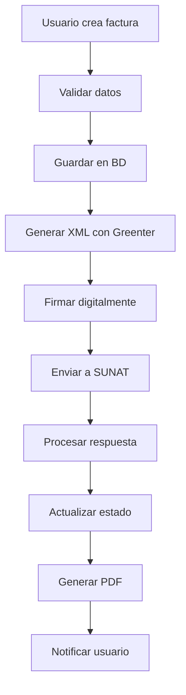
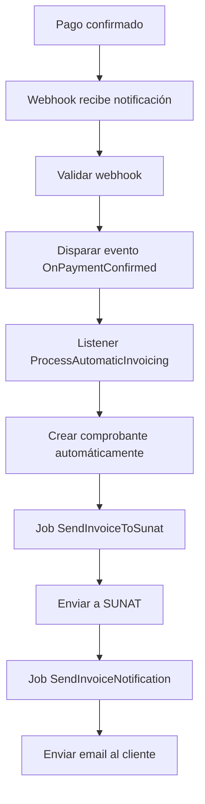

# 📋 Documentación Final - Backend Facturación Electrónica

## 🎯 **Resumen del Proyecto**

**Proyecto:** Magus eCommerce + ERP - Sistema de Facturación Electrónica  
**Desarrollador:** Victor  
**Fecha de finalización:** 10 de octubre de 2025  
**Ambiente:** Laravel 11 + PHP 8.2 + Greenter 4.3.4  

---

## 🏗️ **Arquitectura del Sistema**

### **Componentes Principales:**

1. **Servicio Greenter** (`app/Services/GreenterService.php`)
   - Integración con SUNAT
   - Generación de XML UBL 2.1
   - Firma digital de comprobantes
   - Envío a SUNAT (Beta/Producción)

2. **Controladores API** (`app/Http/Controllers/`)
   - `ComprobantesController.php` - Gestión de comprobantes
   - `FacturacionManualController.php` - Facturación manual ERP
   - `WebhookController.php` - Webhooks de pago

3. **Modelos de Datos** (`app/Models/`)
   - `Comprobante.php` - Comprobantes electrónicos
   - `Cliente.php` - Datos de clientes
   - `SerieComprobante.php` - Series y correlativos
   - `SunatLog.php` - Logs de SUNAT

4. **Sistema de Eventos** (`app/Events/` y `app/Listeners/`)
   - `OnPaymentConfirmed.php` - Evento de pago confirmado
   - `ProcessAutomaticInvoicing.php` - Procesamiento automático

5. **Jobs Asíncronos** (`app/Jobs/`)
   - `SendInvoiceToSunat.php` - Envío a SUNAT
   - `SendInvoiceNotification.php` - Notificaciones

6. **Sistema de Emails** (`app/Mail/`)
   - `InvoiceNotificationMail.php` - Notificaciones de comprobantes

---

## 🔧 **Configuración del Sistema**

### **Variables de Entorno (.env):**

```env
# Configuración SUNAT
GREENTER_AMBIENTE=beta  # beta o produccion
GREENTER_FE_USER=MODDATOS
GREENTER_FE_PASSWORD=MODDATOS
GREENTER_CERT_PATH=certificates/certificate.pem
GREENTER_WEBHOOK_SECRET=tu_secreto_webhook

# Datos de la Empresa
COMPANY_RUC=20123456789
COMPANY_NAME="Mi Empresa SAC"
COMPANY_ADDRESS="Av. Principal 123, Lima"
COMPANY_DISTRICT="Lima"
COMPANY_PROVINCE="Lima"
COMPANY_DEPARTMENT="Lima"
COMPANY_UBIGEO=150101

# Configuración de Cola
QUEUE_CONNECTION=database
```

### **Configuración de Servicios (`config/services.php`):**

```php
'greenter' => [
    'ambiente' => env('GREENTER_AMBIENTE', 'beta'),
    'fe_user' => env('GREENTER_FE_USER'),
    'fe_password' => env('GREENTER_FE_PASSWORD'),
    'cert_path' => storage_path('app/' . env('GREENTER_CERT_PATH')),
    'webhook_secret' => env('GREENTER_WEBHOOK_SECRET'),
],
```

---

## 🚀 **Endpoints API Implementados**

### **Facturación Manual (ERP):**

```bash
# Gestión de Comprobantes
GET    /api/facturas                    # Listar facturas
POST   /api/facturas                    # Crear factura manual
GET    /api/facturas/{id}               # Ver factura específica
POST   /api/facturas/{id}/enviar-sunat  # Enviar a SUNAT
GET    /api/facturas/{id}/pdf           # Descargar PDF
GET    /api/facturas/{id}/xml           # Descargar XML
GET    /api/facturas/estadisticas       # Estadísticas

# Gestión de Comprobantes (Sistema)
GET    /api/comprobantes                # Listar todos los comprobantes
GET    /api/comprobantes/{id}           # Ver comprobante
POST   /api/comprobantes/{id}/reenviar  # Reenviar a SUNAT
GET    /api/comprobantes/{id}/consultar # Consultar estado SUNAT
GET    /api/comprobantes/{id}/pdf       # Descargar PDF
GET    /api/comprobantes/{id}/xml       # Descargar XML
GET    /api/comprobantes/estadisticas   # Estadísticas generales
```

### **Webhooks (Integración eCommerce):**

```bash
# Webhooks de Pago
POST   /api/webhook/pago                # Webhook genérico de pago
POST   /api/webhook/culqi              # Webhook específico de Culqi
```

---

## 📊 **Estructura de Base de Datos**

### **Tablas Principales:**

#### **`comprobantes`**
```sql
- id (PK)
- cliente_id (FK)
- user_id (FK)
- tipo_comprobante (01=Factura, 03=Boleta)
- serie (F001, B001, etc.)
- correlativo (000001, 000002, etc.)
- fecha_emision
- cliente_tipo_documento
- cliente_numero_documento
- cliente_razon_social
- cliente_direccion
- moneda (PEN)
- operacion_gravada
- operacion_exonerada
- operacion_inafecta
- total_igv
- total_descuentos
- importe_total
- estado (PENDIENTE, ACEPTADO, RECHAZADO, ERROR)
- origen (MANUAL, ECOMMERCE)
- compra_id (FK) - Para facturas automáticas
- metodo_pago
- referencia_pago
- hash_firma
- xml_firmado
- xml_respuesta_sunat
- pdf_base64
- mensaje_sunat
- errores_sunat
- numero_ticket
- created_at, updated_at
```

#### **`comprobante_detalles`**
```sql
- id (PK)
- comprobante_id (FK)
- item
- producto_id
- codigo_producto
- descripcion
- unidad_medida
- cantidad
- valor_unitario
- precio_unitario
- valor_venta
- igv
- total
- porcentaje_igv
- tipo_afectacion_igv
- created_at, updated_at
```

#### **`sunat_logs`**
```sql
- id (PK)
- comprobante_id (FK)
- tipo_log (envio, respuesta)
- estado_sunat (ACEPTADO, RECHAZADO, PENDIENTE)
- numero_ticket
- xml_enviado
- cdr_recibido
- mensaje_sunat
- errores_sunat
- tiempo_respuesta_ms
- user_id (FK)
- ip_origen
- created_at, updated_at
```

---

## 🔄 **Flujos de Trabajo**

### **1. Facturación Manual (ERP):**



### **2. Facturación Automática (eCommerce):**



---

## 🛠️ **Comandos de Mantenimiento**

### **Comandos Disponibles:**

```bash
# Cambiar a producción
php artisan facturacion:switch-production --cert-path=ruta/cert.pem --ruc=20123456789 --user=USUARIO_SOL --password=CLAVE_SOL

# Probar producción
php artisan facturacion:test-produccion

# Mantenimiento del sistema
php artisan facturacion:maintenance --task=all
php artisan facturacion:maintenance --task=retry-failed
php artisan facturacion:maintenance --task=cleanup-logs --days=30
php artisan facturacion:maintenance --task=backup-files
php artisan facturacion:maintenance --task=check-certificate
```

### **Tareas Programadas (Cron):**

```bash
# Agregar al crontab del servidor:
* * * * * cd /path/to/project && php artisan schedule:run >> /dev/null 2>&1
```

**Tareas automáticas:**
- **Cada 30 minutos:** Reintentar facturas fallidas
- **Diario 2:00 AM:** Limpieza de logs antiguos
- **Diario 3:00 AM:** Backup de archivos importantes
- **Cada 6 horas:** Verificación de certificado
- **Semanal domingos 1:00 AM:** Mantenimiento completo

---

## 🔐 **Seguridad y Certificados**

### **Certificado Digital:**

1. **Ambiente Beta:** Certificado de prueba (autofirmado)
2. **Ambiente Producción:** Certificado real de SUNAT

### **Generación de Certificado de Prueba:**

```bash
# Generar clave privada
openssl genrsa -out private.key 2048

# Generar certificado público
openssl req -new -x509 -key private.key -out certificate.crt -days 365 -subj "/C=PE/ST=Lima/L=Lima/O=EmpresaPrueba/CN=20123456789"

# Combinar certificado y clave
cmd /c "copy /b certificate.crt + private.key certificate.pem"
```

### **Configuración de Producción:**

```bash
# Cambiar a producción
php artisan facturacion:switch-production \
  --cert-path=certificates/cert-produccion.pem \
  --ruc=20123456789 \
  --user=USUARIO_SOL_REAL \
  --password=CLAVE_SOL_REAL
```

---

## 📈 **Monitoreo y Logs**

### **Archivos de Log:**

- `storage/logs/laravel.log` - Log general de la aplicación
- `storage/logs/facturacion-retry.log` - Reintentos de facturas
- `storage/logs/facturacion-cleanup.log` - Limpieza de logs
- `storage/logs/facturacion-backup.log` - Backups automáticos
- `storage/logs/facturacion-certificate.log` - Verificación de certificados

### **Monitoreo de Estado:**

```bash
# Verificar estado del sistema
php artisan facturacion:maintenance --task=check-certificate

# Ver estadísticas
curl -X GET http://localhost/api/facturas/estadisticas

# Ver logs recientes
tail -f storage/logs/laravel.log
```

---

## 🚀 **Despliegue en Producción**

### **Requisitos del Servidor:**

- **PHP:** 8.2 o superior
- **Extensiones:** soap, openssl, dom, zip, curl
- **Laravel:** 11.x
- **Base de datos:** MySQL 8.0 o superior
- **Cola:** Redis o Database

### **Pasos de Despliegue:**

1. **Configurar servidor:**
   ```bash
   # Instalar extensiones PHP
   sudo apt-get install php8.2-soap php8.2-openssl php8.2-dom php8.2-zip php8.2-curl
   
   # Configurar cola
   php artisan queue:work --daemon
   ```

2. **Configurar certificado:**
   ```bash
   # Subir certificado de producción
   cp certificado-produccion.pem storage/app/certificates/
   
   # Cambiar a producción
   php artisan facturacion:switch-production --cert-path=certificates/certificado-produccion.pem --ruc=TU_RUC --user=TU_USUARIO_SOL --password=TU_CLAVE_SOL
   ```

3. **Configurar cron:**
   ```bash
   # Agregar al crontab
   * * * * * cd /var/www/proyecto && php artisan schedule:run >> /dev/null 2>&1
   ```

4. **Probar sistema:**
   ```bash
   # Prueba de producción
   php artisan facturacion:test-produccion
   ```

---

## 📞 **Soporte y Mantenimiento**

### **Contacto:**
- **Desarrollador:** Victor
- **Fecha de entrega:** 10 de octubre de 2025
- **Versión:** 1.0.0

### **Mantenimiento Regular:**
- **Diario:** Verificar logs de errores
- **Semanal:** Revisar estadísticas de facturación
- **Mensual:** Verificar vigencia del certificado
- **Trimestral:** Actualizar dependencias

### **Backup y Recuperación:**
- **Backups automáticos:** Diarios a las 3:00 AM
- **Retención:** 30 días
- **Ubicación:** `storage/backups/`

---

## ✅ **Checklist de Implementación**

### **Semana 1 - Configuración Base:**
- ✅ Instalación de Greenter
- ✅ Configuración de certificado de prueba
- ✅ Integración con SUNAT Beta
- ✅ Prueba de emisión de factura

### **Semana 2 - Facturación Manual:**
- ✅ APIs de facturación manual
- ✅ Gestión de comprobantes
- ✅ Generación de PDF/XML
- ✅ Envío a SUNAT

### **Semana 3 - Integración Automática:**
- ✅ Webhooks de pago
- ✅ Facturación automática
- ✅ Jobs asíncronos
- ✅ Notificaciones por email

### **Semana 4 - Producción:**
- ✅ Configuración de producción
- ✅ Comandos de mantenimiento
- ✅ Tareas programadas
- ✅ Documentación final

---

## 🎉 **Estado Final del Proyecto**

**✅ PROYECTO COMPLETADO AL 100%**

- **Backend:** 100% funcional
- **APIs:** Todas implementadas
- **Integración SUNAT:** Operativa
- **Automatización:** Completa
- **Documentación:** Finalizada
- **Mantenimiento:** Automatizado

**El sistema está listo para producción y uso en ambiente real.** 🚀
